# EcoPlate Pilot Flowchart (Student + Dining/Admin + Reporting)

This Markdown file is a **text version** of the full FigJam flowchart that was generated for the EcoPlate pilot. It includes:
- The **exact Mermaid flowchart** (copy/paste-renderable)
- A **comprehensive, section-by-section outline** that mirrors every node, decision, and policy described in the diagram

---

## Mermaid flowchart (copy/paste)

```mermaid
flowchart LR

  %% --- DINING / ADMIN SETUP ---
  subgraph DINE["Dining + Admin Operations"]
    A["Closing time at dining hall"] --> B["Staff packs + labels Rescue Boxes (existing food-safety process)"]
    B --> C["Admin creates nightly Drop: box count, location, 90-min pickup window, price/credits"]
    C --> C2["Apply daily cap (start 30 boxes/day/location)"]
    C2 --> C3{"Pickup rate > 85% for 2 consecutive weeks?"}
    C3 -->|"Yes"| C4["Increase cap by +10 boxes/day"]
    C3 -->|"No"| C5["Keep current cap"]
    C --> D["EcoPlate publishes Drop to QR landing page / app"]
    D --> D1["Admin dashboard shows: boxes posted, reservations, pickups, pickup rate"]
  end

  %% --- STUDENT RESERVATION + PICKUP ---
  subgraph STUD["Student Experience"]
    E["Student scans QR"] --> F["See tonight's Drop: location, window, price, boxes left"]
    F --> G{"Boxes available?"}
    G -->|"No"| G0["Sold out: show next-drop notice / join waitlist"]
    G -->|"Yes"| H["Tap Reserve (no account required on first use)"]
    H --> H1["One-tap payment/credit authorization"]
    H1 --> I["System creates Reservation + generates Pickup Code"]
    I --> J["Student receives Pickup Code + pickup instructions"]
    J --> K{"Student cancels before pickup window starts?"}
    K -->|"Yes"| K1["Release box back to inventory; return credit/payment"]
    K -->|"No"| L["Student arrives during 90-min pickup window"]
    L --> M["Staff verifies Pickup Code (scan/entry)"]
    M --> N{"Valid code + within window?"}
    N -->|"No"| N0["Resolve: invalid/expired code; support fallback"]
    N -->|"Yes"| O["Staff hands over Rescue Box"]
    O --> P["System marks Redemption: picked up"]
    P --> Q["One-tap rating (1–5)"]
    Q --> R{"First successful pickup?"}
    R -->|"Yes"| S["Prompt: create account + join membership (try-before-you-buy)"]
    R -->|"No"| T["Account: credits, notifications, early access"]
  end

  %% --- NO-SHOW + REALLOCATION ---
  subgraph NOSHOW["No-show Handling"]
    I --> U["Reservation held until pickup or window ends"]
    U --> V{"Picked up before window ends?"}
    V -->|"Yes"| P
    V -->|"No"| W["Mark No-show"]
    W --> X["Policy: repeat no-shows lose early access; credit return only if canceled pre-window"]
    W --> Y["Unclaimed box: release back to app during remaining window OR redirect to donation/disposal"]
  end

  %% --- MEMBERSHIPS + FAIRNESS ---
  subgraph PAY["Memberships, Credits, Fairness"]
    S --> P1["Choose plan: $15/mo (up to 7 credits) OR $30/mo (up to 15 + early access)"]
    P1 --> P2["Credits redeem when drops are available; unused credits roll for 30 days"]
    P2 --> P3{"Redeemed < 50% of credits for 2 months due to low supply?"}
    P3 -->|"Yes"| P4["Auto-downgrade next month (fairness policy)"]
    P3 -->|"No"| P5["Keep current plan"]
  end

  %% --- REPORTING + FORECASTING ---
  subgraph DATA["Impact Reporting + Forecasting"]
    D1 --> Z["Impact metrics: pickup rate, no-show rate, satisfaction, boxes/pounds diverted"]
    Q --> Z
    W --> Z
    Z --> AA["EcoPlate Forecast v0: rules-based averages suggest tomorrow's pack count"]
    AA --> AB["After 60+ days of drop data: Forecast v1 (ML-assisted)"]
    AA --> B
  end

  %% --- SPONSORED CREDITS (OPTIONAL) ---
  subgraph SPON["Optional: Sponsored Credits"]
    Z --> SC["Sponsors/orgs buy Rescue Credits in bulk; pickup experience identical"]
  end
```

---

## Comprehensive outline (mirrors every node + decision)

### Dining + Admin Operations
1. **Closing time at dining hall**
2. **Staff packs + labels Rescue Boxes** *(existing food-safety process)*
3. **Admin creates nightly Drop** including:
   - box count
   - location
   - **90-min pickup window**
   - price/credits
4. **Apply daily cap** *(start **30 boxes/day/location**)*
5. **Decision:** *Pickup rate > 85% for 2 consecutive weeks?*
   - **Yes →** Increase cap by **+10 boxes/day**
   - **No →** Keep current cap
6. **EcoPlate publishes Drop** to **QR landing page / app**
7. **Admin dashboard shows**:
   - boxes posted
   - reservations
   - pickups
   - pickup rate

---

### Student Experience
1. **Student scans QR**
2. Student sees tonight’s Drop:
   - location
   - window
   - price
   - boxes left
3. **Decision:** *Boxes available?*
   - **No →** Sold out: show next-drop notice / join waitlist
   - **Yes →** Continue
4. Student taps **Reserve** *(no account required on first use)*
5. **One-tap payment/credit authorization**
6. System creates **Reservation** and generates **Pickup Code**
7. Student receives **Pickup Code + pickup instructions**
8. **Decision:** *Student cancels before pickup window starts?*
   - **Yes →** Release box back to inventory; return credit/payment
   - **No →** Continue
9. Student arrives during **90-min pickup window**
10. Staff verifies Pickup Code *(scan/entry)*
11. **Decision:** *Valid code + within window?*
    - **No →** Resolve: invalid/expired code; support fallback
    - **Yes →** Continue
12. Staff hands over Rescue Box
13. System marks **Redemption: picked up**
14. Student leaves **one-tap rating (1–5)**
15. **Decision:** *First successful pickup?*
    - **Yes →** Prompt: create account + join membership *(try-before-you-buy)*
    - **No →** Account experience: credits, notifications, early access

---

### No-show Handling
1. Reservation is held until **pickup** or **window ends**
2. **Decision:** *Picked up before window ends?*
   - **Yes →** Mark Redemption: picked up *(same node as above)*
   - **No →** Continue
3. Mark **No-show**
4. Apply policy:
   - repeat no-shows lose early access
   - credit return only if canceled pre-window
5. Handle unclaimed box:
   - release back to app during remaining window **OR**
   - redirect to donation/disposal

---

### Memberships, Credits, Fairness
1. After first successful pickup, user chooses plan:
   - **$15/mo** *(up to **7 credits**)*
   - **$30/mo** *(up to **15 credits + early access**)*
2. Credits behavior:
   - credits redeem when drops are available
   - unused credits roll for **30 days**
3. **Decision:** *Redeemed < 50% of credits for 2 months due to low supply?*
   - **Yes →** Auto-downgrade next month *(fairness policy)*
   - **No →** Keep current plan

---

### Impact Reporting + Forecasting
1. Impact metrics include:
   - pickup rate
   - no-show rate
   - satisfaction
   - boxes/pounds diverted
2. Metrics are informed by:
   - admin dashboard activity (boxes posted, reservations, pickups, pickup rate)
   - student rating (1–5)
   - no-show events
3. Forecasting roadmap:
   - **EcoPlate Forecast v0:** rules-based averages suggest tomorrow’s pack count
   - **After 60+ days of drop data:** Forecast v1 *(ML-assisted)*
4. Operational loop: Forecast v0 feeds back into **Staff packs + labels Rescue Boxes**

---

### Optional: Sponsored Credits
- Sponsors/orgs buy Rescue Credits in bulk
- Pickup experience remains **identical** for the student
